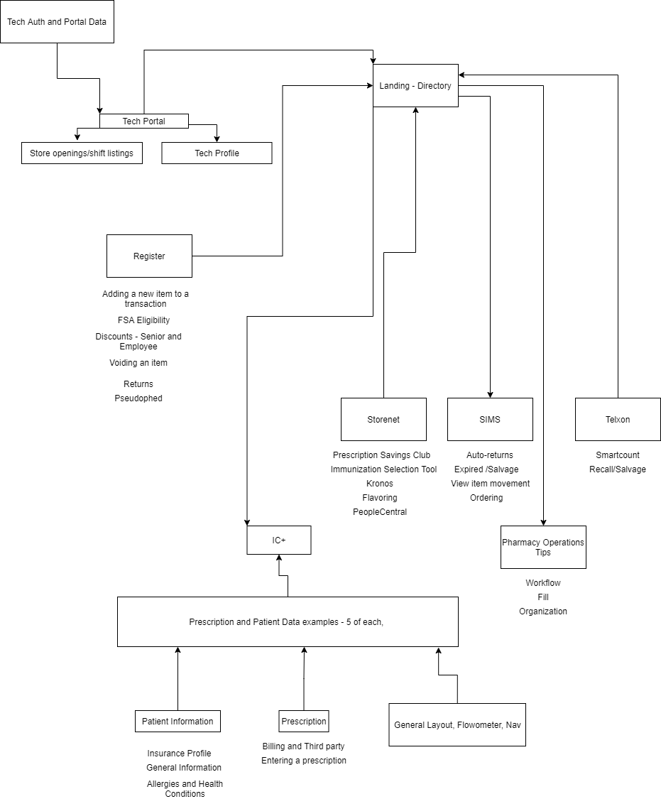

# wtrm

Learning exercise for recoil and an opportunity to begin working on a training module for new pharmacy techs at Walgreens with general system tips, ui explanation, potentially a tech portal for techs to login, share open positions or shifts, or submit suggestions for the site or operations tips and tricks. I.e. Specific insurance billing - sorted by state.

Going to set up routing, learn a bit more about recoil, and then work on general ui elements before tackling portal, backend, and database stuff.

